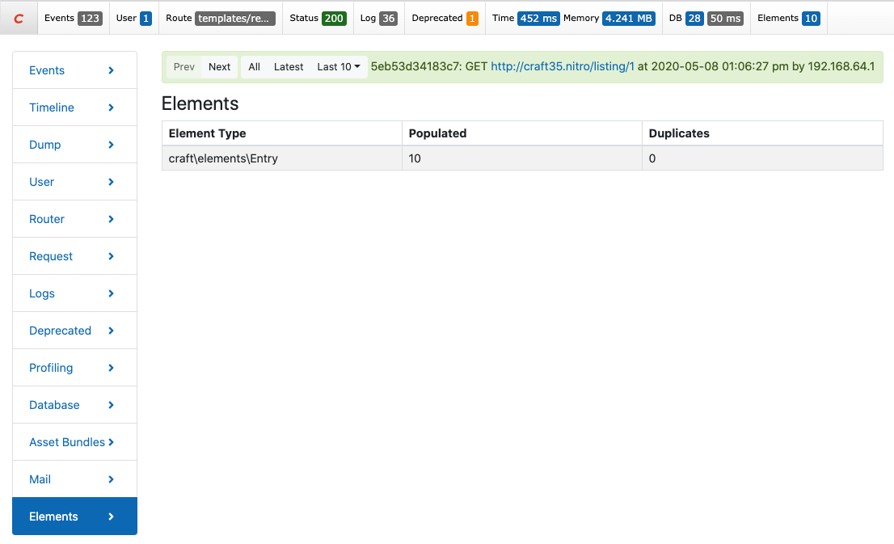

<p align="center"></p>

# Elements Panel Plugin

A plugin for Craft CMS 3 that adds an Elements and an Eager-Loading panel to the debug toolbar.



## Requirements

Craft CMS 3.0.0 or later.

## Installation

Install the plugin using composer.

```
composer require putyourlightson/craft-elements-panel
```

## License

This plugin is licensed for free under the MIT License.

<small>Created by [PutYourLightsOn](https://putyourlightson.com/).</small>
