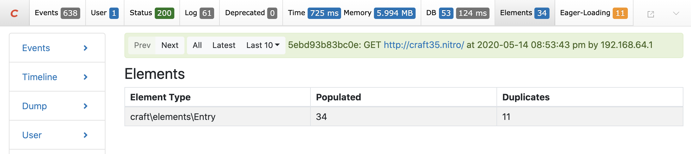
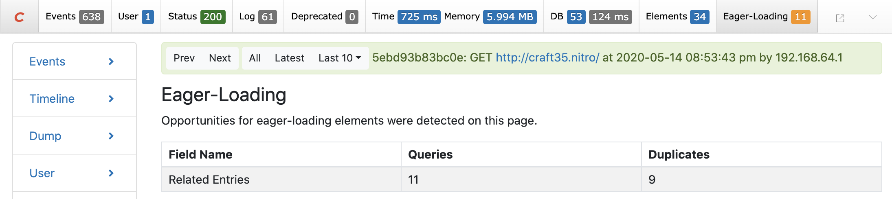

<p align="center"></p>

# Elements Panel Plugin

A plugin for Craft CMS 3 that adds an Elements and an Eager-Loading panel to the debug toolbar.

> This plugin is currently in beta. Please contribute by reporting any bugs or issues.

## Elements

Displays how many elements were populated and how many are duplicates, grouped by element type.



## Eager-Loading

Warns you if opportunities for eager-loading elements are detected. Displays how many queries were executed (that could be eager-loaded) and how many are duplicates, grouped by field name.



## Requirements

Craft CMS 3.0.0 or later.

## Installation

Install the plugin using composer.

```
composer require putyourlightson/craft-elements-panel:^1.0.0-beta.1
```

## License

This plugin is licensed for free under the MIT License.

<small>Created by [PutYourLightsOn](https://putyourlightson.com/).</small>
